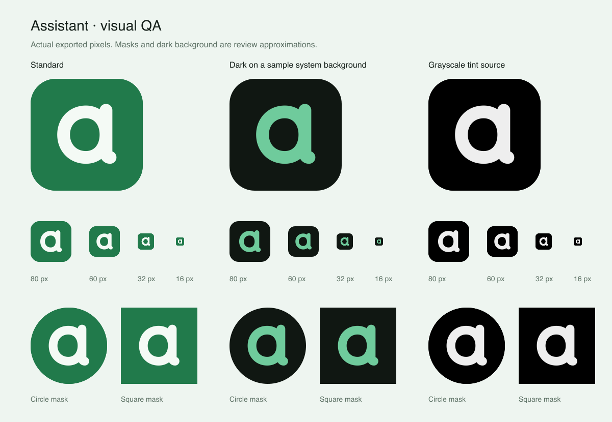

# Logo and icon QA — September 7, 2026

Scope: the Assistant logo, iOS icon appearances, web favicon, Apple touch icon,
PWA install assets, and their export workflow.

## Refinements

- Raised the upper stem by 20 source units to preserve the lowercase a silhouette
  at small sizes, keeping the rounded loop and short foot.
- Removed the dark icon's baked-in background, following
  [Apple's asset-catalog guidance](https://developer.apple.com/documentation/xcode/configuring-your-app-icon).
  The standard and tinted assets remain opaque; the tinted source is grayscale
  on black.
- Replaced the web install manifest's old teal theme and canvas colors with the
  current green and pale-green palette.
- Added `pnpm brand:check` for canonical-export parity and the
  [maskable icon safe area](https://www.w3.org/TR/appmanifest/#icon-masks).
  The generator now preserves unchanged files.

## Visual review

Inspected the actual exported pixels in all three appearances at 16, 32, 60,
80, 220, and 1024 pixels. Compared the previous and refined upper stem, including
an enlarged 16px raster. Reviewed rounded, circular, and square masks, clear
space, edge smoothing, the open counter, and the short foot.

Measured mark/background contrast is 5.02:1 for the standard icon, 9.28:1 for the
illustrative dark background, and 18.10:1 for the grayscale tint source. Actual
system dark backgrounds and user-selected tints can differ. These are design
measurements, not a claim about every system appearance.

## Validation

- Nine shipping exports match the canonical vector.
- A repeat generation updates zero files.
- Isolated negative checks reject a stale export and a mark outside the
  centered 40%-radius maskable safe zone.
- All three iOS sources are 1024×1024. Standard is opaque, dark has a transparent
  background with opaque foreground, and tinted is opaque grayscale.
- The signed app's compiled asset catalog contains standard, dark, and tintable
  phone renditions. The dark rendition retains transparency; the tintable
  rendition compiles as monochrome.
- All 170 iOS tests passed. Signed Release iPhone build passed.
- Production web build, typecheck, lint, architecture checks, and
  `git diff --check` passed. Existing lint and iOS orientation warnings remain.
- Local production HTTP checks returned 200 with the expected MIME types and
  dimensions for the SVG favicon, Apple touch icon, and both PWA PNGs. The live
  local manifest returned the updated colors and maskable-icon declaration.

## Limits

The review sheet uses approximate masks and an illustrative dark background.
The initial pass was blocked by the Mac lock and unavailable paired phone.
The follow-up validation completed after both became accessible:

- Inspected the installed icon on the iOS 26.5 simulator home screen in Default,
  Dark, Tinted Light, Tinted Dark, Clear Light, and Clear Dark appearances. Waited
  for icon rendering to settle after each transition. The mark remained visible
  and legible without clipping. Restored the original Default appearance.
- Rechecked all nine exports, safe-area validation, the compiled icon renditions,
  and the signed app with `codesign --verify --deep --strict`.
- Installed the refreshed signed app on Baldvin's paired iPhone 15 Pro and
  confirmed a successful launch through CoreDevice.

Physical-device home-screen appearance was not visually inspected; the six
appearance checks were performed in the simulator. Production web deployment
is verified separately from this icon QA pass. The pre-existing Xcode
project-file edits were left untouched.
