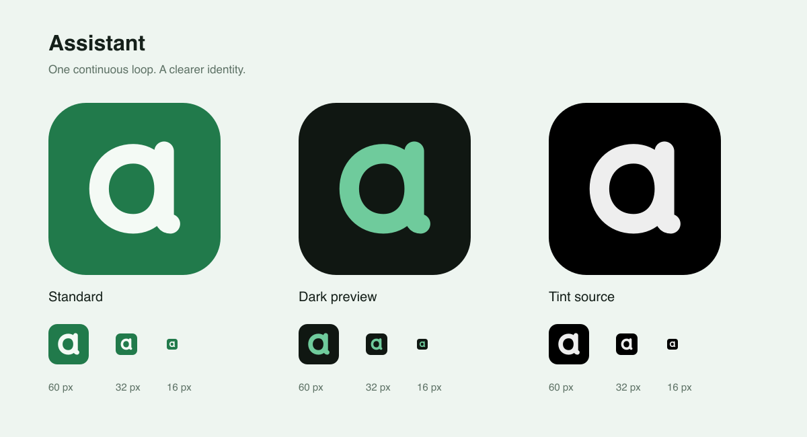

# Assistant identity

The mark is a rounded lowercase **a**, drawn as one continuous loop. Its open
counter, even stroke and upright right stem remain recognizable at small sizes.
A short foot and visible upper stem distinguish it from a Q. The slight optical
offset balances the loop against the stem. It uses the native
app's existing green palette:

| Role | Color |
| --- | --- |
| Standard background | `#217A4B` |
| Standard mark | `#F4FAF5` |
| Dark background | System-provided; preview uses `#101712` |
| Dark mark | `#6FCB9C` |
| Tinted background / mark | `#000000` / `#EEEEEE` |

## Editing and export

Edit `apps/web/public/icons/assistant-source.svg`, then run `pnpm brand:generate`.
The generator updates the iOS asset catalog, browser favicon, Apple touch icon,
192px and 512px PWA icons, standalone `assistant-mark.svg`, and this preview.
The standalone vector uses `currentColor` and has a transparent background.

The standard iOS and PWA artwork is opaque and square, with no baked-in corner
mask. The dark iOS asset has a transparent background so the system supplies
its own background. The browser favicon has rounded corners. The preview
approximates a rounded home-screen mask and dark background; it is not a device
screenshot. The tinted source is grayscale so the system can apply the user's
chosen tint.

Run `pnpm brand:check` to verify all nine shipping assets against the canonical
vector and check the maskable safe area. This is read-only and fails on missing
or stale exports. Generation preserves unchanged files to avoid unnecessary
asset recompilation. The font-dependent review sheet is excluded from export
parity checks. See [the QA report](QA.md) and [visual QA sheet](qa-preview.png).

Use the original shape and generous clear space. Do not stretch it, add a
sparkle, or replace functional interface symbols with the logo. The brand mark
identifies the app; existing status symbols still communicate app state.

The asset catalog follows Apple's [app icon configuration guidance](https://developer.apple.com/documentation/xcode/configuring-your-app-icon).
